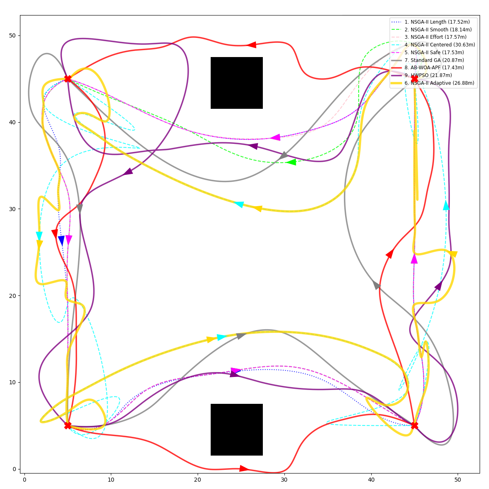
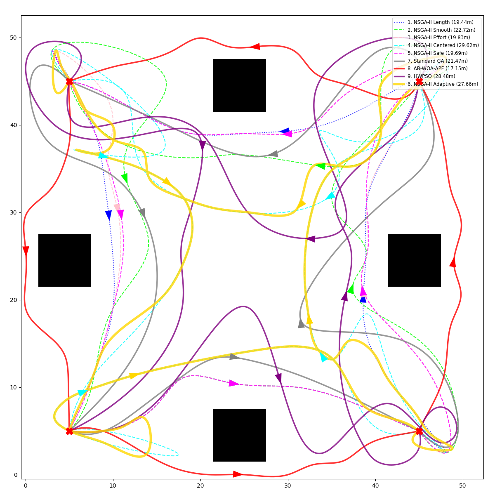
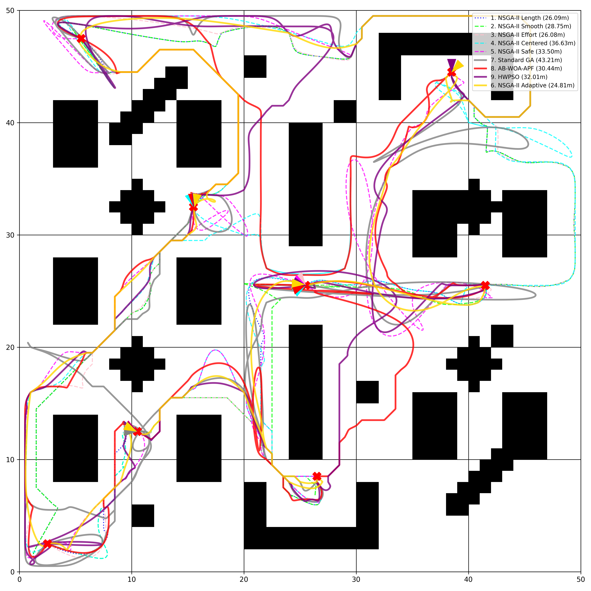

# AStar and NSGA-II Patrolling for Two-wheeled Non-holonomic Mobile Robot
In this study, a hierarchical path planning approach is presented for patrolling tasks requiring mobile robots with differential drive to sequentially visit specific target points (waypoints) in static obstacle environments. Patrolling tasks necessitate that the robot perform safe manoeuvres compliant with kinematic constraints while maintaining energy efficiency during long-term operations. However, traditional genetic algorithms fail to converge to a valid solution space when randomly initialised on such multi-point and complex maps. To address this issue, the deterministic structure of the A* algorithm is combined with the multi-objective optimisation capability of NSGA-II (Non-dominated Sorting Genetic Algorithm II) within a hybrid framework. The method first creates an obstacle-free guide path (seed path) between patrol points using A*, then adapts this path to the robot's manoeuvrability using B-Spline curves. During the optimisation process, the total wheel effort (energy), trajectory curvature (smoothness), and safety margin are simultaneously minimised. Simulation results demonstrate that the proposed method produces more sustainable, smooth, and collision-free Pareto-optimal solutions for planning patrol routes compared to Standard GA and other hybrid methods.

Results on "easy" level environment:

Results on "moderate" level environment:

Results on "hard" level environment:
